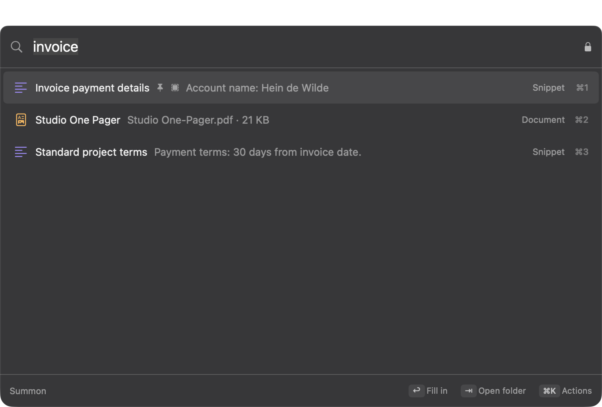
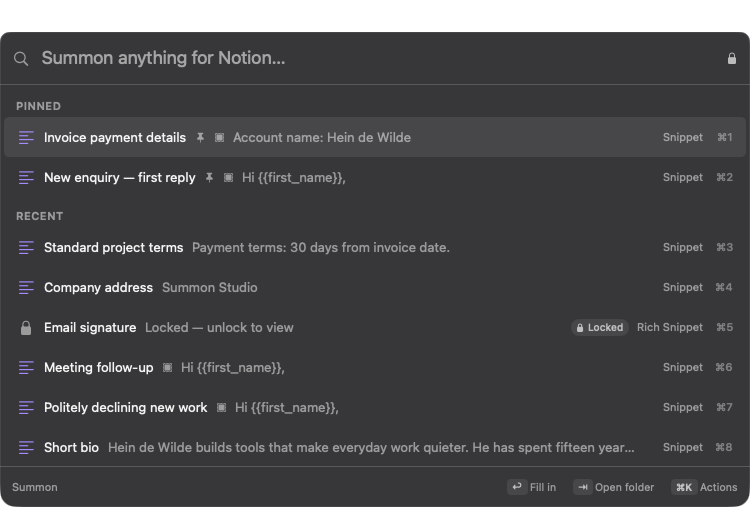
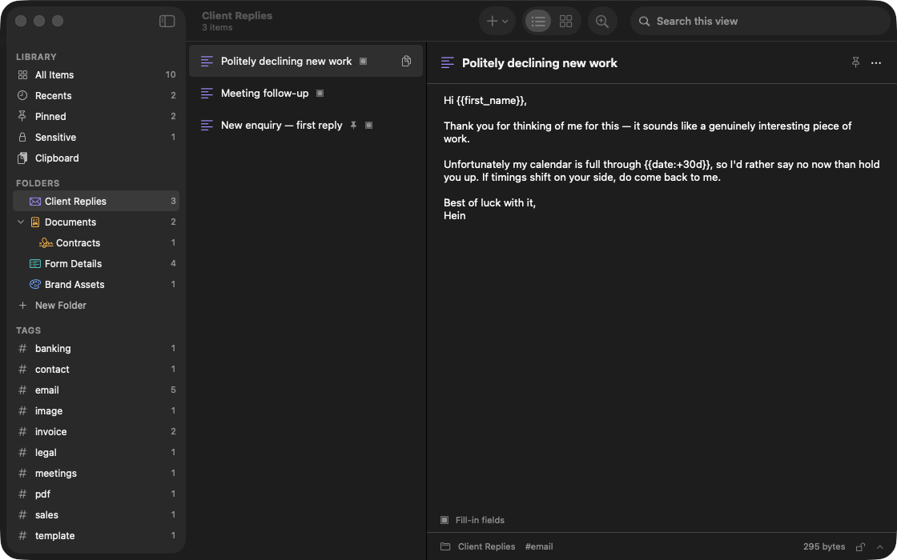
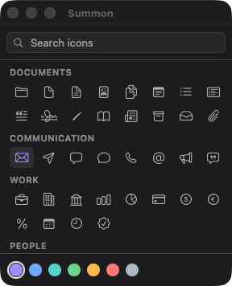
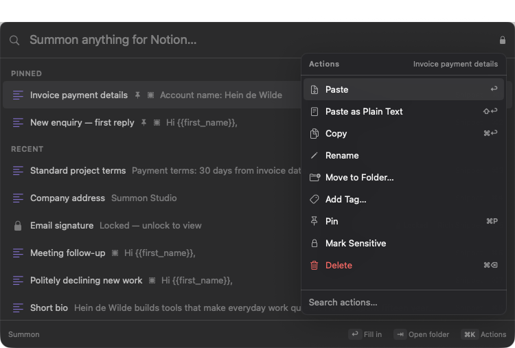
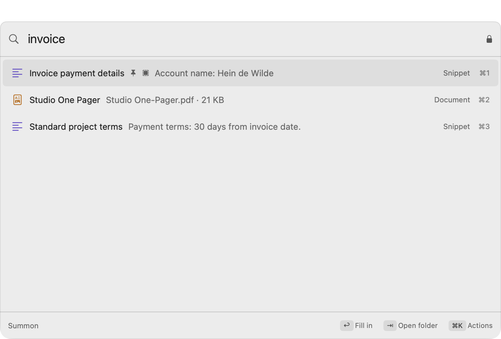

<h1 align="center">Summon 🌀</h1>

<p align="center">
  <em>
    Everything you reuse, one keystroke away.<br>
    Fast&nbsp;&nbsp;·&nbsp;&nbsp;
    Private&nbsp;&nbsp;·&nbsp;&nbsp;
    On-device&nbsp;&nbsp;·&nbsp;&nbsp;
    Keyboard-first
  </em>
</p>

<p align="center">
  <a href="https://github.com/heindewilde/summon/actions/workflows/ci.yml"></a>
  <a href="LICENSE"></a>
  
  
  
  
</p>

<p align="center">
  <a href="https://summon.technology"><strong>summon.technology →</strong></a>
  or
  <a href="#-build-it"><strong>build from source</strong></a>
</p>

<p align="center">
  
</p>

---

## Why Summon?

**Narrower on purpose.** Summon is not a notes app — it isn't where you write. It's not a file manager — it isn't where you keep everything. It holds only the handful of things you reach for again and again: the canned reply, the portfolio PDF, the VAT number, the headshot. Because it holds less, it can be much better at the one moment that matters — getting one of them to where your cursor already is.

**One keystroke, wherever you are.** Press ⌥Space in any app, type a few characters, press ↩, and the thing lands in the app you were already using. No window to find, no tab to switch to, no clipboard to babysit. The panel appears over your work and disappears again.

**Private because it never leaves.** There is no account, no sync, no telemetry, and no networking code — the app makes no outbound requests at all. Anything you mark sensitive is encrypted with AES-GCM under a key wrapped by your PIN — or by a passphrase, if you want something that holds up against someone who has your disk — so a locked item stays findable by name while revealing nothing of its contents, its file, or even its OCR'd text.

**Fast, and measured rather than claimed.** A keystroke re-ranks 2,000 items in **0.55 ms**. Those numbers are asserted by the test suite against budgets that fail the build — because the first time performance was "fixed" here, the benchmark and the app disagreed about what was being measured, and nobody noticed for a whole commit.

---

## Summon in 30 seconds

<table>
<tr>
<td width="33%" valign="top">

### ⌨️ Summon anything
⌥Space from any app, type a few letters, ↩. It pastes into whatever you were just using. Fuzzy search, ranked by what you actually reach for.

</td>
<td width="33%" valign="top">

### 📎 Keep what you reuse
Text, rich text, images, PDFs, whole files. Dropped in, copied in, or grabbed from your selection without leaving the app you're in.

</td>
<td width="33%" valign="top">

### 📝 Fill in the blanks
`Hi {{first_name}},` turns the panel into a small form. Dates, the clipboard, and where the caret lands are placeholders too.

</td>
</tr>
<tr>
<td width="33%" valign="top">

### 🗂 Organise lightly
Nested folders you drag to rearrange, each with its own icon and colour. Plus tags, pins, and a search that reaches inside PDFs.

</td>
<td width="33%" valign="top">

### 🔒 Lock what's private
Mark anything sensitive and it's encrypted at rest. Titles stay searchable; contents don't. Unlock with a PIN or a passphrase, auto-lock on a timer.

</td>
<td width="33%" valign="top">

### 🏠 Never leaves the Mac
No account, no sync, no analytics, no networking code. Your library is a folder you can back up yourself.

</td>
</tr>
</table>

---

## Feature tour

### ⌨️ The summon moment

<p align="center">
  
</p>

Press ⌥Space and the panel appears over whatever you're doing without disturbing it. Before you type anything it shows what you're most likely to want: things you've pinned, then things you've used recently. If you've used an item in this app before, a section named for that app comes first — so Mail surfaces your canned replies and Finder surfaces your documents.

Type, and results are ranked by a fuzzy match, by how often and how recently you've used each item, and by whether you've used it *in this app before*. The characters that matched are picked out in the title, so it's always clear why a result is in the list.

`↩` pastes it where your cursor already was. `⌘↩` copies instead, `⌥↩` opens the file, `⇧↩` pastes as plain text, and `⌘1`–`⌘9` jump straight to a result.

### 📎 Getting things in

Four ways, because the friction of saving is what decides whether a tool like this gets used at all:

- **Drag and drop** files onto the panel, the library, or a specific folder.
- **⌥⇧S** saves whatever is selected right now, without leaving the app you're in. In Finder it reads the selection directly; elsewhere it copies, reads the pasteboard, and puts your previous clipboard contents back.
- **Clipboard history** keeps the last 40 things you copied so you can promote one into the library. It skips anything a password manager marks as concealed, and ignores 1Password, Bitwarden and Keychain Access entirely.
- **"Add to Summon"** registers in the system Services menu, so it appears in the right-click menu of every app.

### 📝 Fill-in fields

A snippet can have blanks:

```
Hi {{first_name}},

Thanks for getting in touch about {{topic:your enquiry}}. I will come back to you
by {{date:+3d}}.

{{cursor}}

Best,
Hein
```

Choose it and the panel becomes a small form — Tab between fields, ↩ to insert. Repeating a name reuses the value you already typed. `{{date}}`, `{{time}}` and `{{clipboard}}` fill themselves in, and the caret ends up exactly where `{{cursor}}` was.

### 🗂 Folders, tags and pins

<p align="center">
  
</p>

Folders nest as deep as you like and rearrange by dragging — drop onto a folder to nest inside it, between two to reorder. Each gets its own icon and colour from a curated set of about ninety SF Symbols, searchable by meaning rather than by name: "money" finds the currency symbols, "vat" finds percent, "password" finds the key.

<p align="center">
  
</p>

Tags cut across folders, pins float things to the top, and filters can be typed inline: `#tag`, `/folder`, `img:`, `pdf:`, `txt:`, `file:`, `pinned:`, `locked:`.

### ⌘K — every action, without the clutter

<p align="center">
  
</p>

⌘K opens every action for the selected item, searchable, with each shortcut beside it: paste, paste as plain text, copy, open, reveal in Finder, rename, move to folder, add tag, pin, mark sensitive, delete.

It exists in the panel and only in the panel. A window has room to show its actions, so the library shows them rather than hiding them a level down.

### 🔒 Sensitive items

Mark an item or a whole folder sensitive and its contents are encrypted at rest:

- A random 256-bit master key is generated once. Per-item keys derive from it via HKDF using the item's own UUID, so no key is ever reused across two items.
- That master key is wrapped **twice** — under your PIN or passphrase with PBKDF2-SHA256 at 600,000 iterations, and separately in the Keychain behind Touch ID. Changing it re-wraps one small key, so it is instant rather than a re-encryption of everything. Switching between a PIN and a passphrase is that same re-wrap: nothing is decrypted.
- Unlocked, the key exists only in memory. It is discarded on lock, on a timeout you choose, and on sleep. Decrypted scratch copies go at the same moment.
- Five wrong guesses start an escalating cooldown that survives a relaunch, on every path that takes a guess — unlocking and changing it both.

**A PIN and a passphrase defend against different people.** Four digits is 10,000 combinations, and the cooldown that makes that reasonable only applies to someone typing into this app. It cannot apply to someone who has copied the library folder, because `vault.wrap` is just a file and they can guess against it offline as fast as their hardware allows — at which point 10,000 is not a wait. A PIN is the right default for the summon moment and enough to stop someone who wanders past an unlocked Mac. Choose a passphrase if the threat you have in mind is someone walking off with the disk.

**Titles stay visible; contents do not.** A locked item is still findable by name and tag, but matches nothing in its body, its file, or its OCR'd text — that last one is what stops a locked passport scan being found by searching its own contents. Sensitive content is never handed to the language model either, local though it is.

### ✨ On-device intelligence, never load-bearing

Images are OCR'd with Vision and PDFs are read with PDFKit, so their contents are searchable — that is how "discovery call" finds a phrase buried on page four of a PDF. Apple's on-device model suggests a title, tags and a one-line summary when you import something, and rewrites a snippet in a different register.

If Apple Intelligence is off, unavailable, or still downloading, every one of those falls back to plain heuristics and the app carries on. Settings shows the real status rather than pretending.

### 🌗 Light and dark

<p align="center">
  
</p>

Both appearances are tuned separately, and every text tier is asserted by a test to clear WCAG AA contrast against its background — because the first monochrome palette looked perfectly fine on screen while sitting at 2.65:1.

---

## ⌨️ The keyboard model

Every binding lives in one place, `PanelKeyMap`, and every one is asserted by a test. The panel once drew `⌘1`–`⌘9` on each row with no handler behind them, which is precisely what that arrangement exists to prevent.

**Global — anywhere in macOS**

| Key | Does |
|---|---|
| `⌥Space` | Summon the panel |
| `⌥⇧S` | Save the current selection without leaving the app you are in |

**In the panel**

| Key | Does |
|---|---|
| `↩` | Paste into the app you were just in |
| `⌘↩` | Copy instead |
| `⌥↩` | Open the file |
| `⇧↩` | Paste as plain text |
| `⌘1`–`⌘9` | Jump straight to a result |
| `↑` `↓` | Move — `⇞` `⇟` by eight, `⌘↑` `⌘↓` or `↖` `↘` to the ends |
| `⌘K` | Actions for the selected item |
| `⌘P` `⌘R` `⌘⌫` | Pin · reveal in Finder · delete, with a confirmation |
| `⇥` | Narrow to the folder the selected item lives in |
| `⌫` | Leave that folder again, when nothing is typed |
| `⎋` | Back exactly one level: menu → mode → query → folder → closed |

Hold `⌘`, `⌥` or `⇧` and the footer relabels itself to say what `↩` will do right now, so the shortcuts are learned by using them rather than by reading this table.

**In the library window**

| Key | Does |
|---|---|
| `⌘L` `⌘,` `⌘Q` | Open the library · Settings · Quit |
| `⌘N` `⇧⌘N` `⌘O` | New snippet · new folder · import files |
| `⌘P` `⌘⌫` `⇧⌘L` | Pin · delete · lock or unlock sensitive items |
| `↑` `↓` `←` `→` | Move through the list or the grid |

The panel deliberately does **not** claim `⌘C`, `⌘V`, `⌘A` or `⌘Z` — those belong to the search field, and the tests assert the fall-through as well as the bindings, because a key map that grabs everything breaks text editing in a way no positive test would catch. One casualty: `⌘⌫` means Delete here, so the field loses delete-to-start-of-line.

---

## 🛠 Build it

```bash
git clone https://github.com/heindewilde/summon
cd summon
Scripts/create-signing-identity.sh   # once — see Permissions, below
Scripts/build-app.sh                 # release build → dist/Summon.app
open dist/Summon.app
```

Requires **macOS 26** and **Xcode 26** (Swift 6.1+). There are **no dependencies** — the entire app builds from the system SDK.

```bash
Scripts/run.sh              # debug build, then launch
Scripts/run.sh --demo       # …against a throwaway library
Scripts/selftest.sh         # 90 runtime checks on a fresh demo library
swift test                  # 287 tests over the logic layer
swift test -c release       # the same, in an optimised build
Scripts/perf.sh             # the wall-clock budgets, on a quiet machine
```

`SUMMON_DEMO=1` points the app at a separate library (`Summon-Demo`), so you can experiment without touching your real one.

### ⬇️ Downloads

**Coming soon.** A notarised build will land at [summon.technology](https://summon.technology) once Summon has an Apple Developer ID. Until then, building takes two minutes and the three commands above.

---

## 🔐 Permissions

Summon asks for as little as it can, and every request has a fallback.

| Permission | What for | If you say no |
|---|---|---|
| **Accessibility** | Pressing ⌘V for you after you choose something | Summon copies instead and shows "press ⌘V". One extra keystroke, nothing else changes |
| **Apple Events** (Finder) | Reading your Finder selection for ⌥⇧S | Summon copies the selection and restores your clipboard afterwards |

Global shortcuts need **no permission at all** — they use Carbon's `RegisterEventHotKey` rather than an event tap, specifically so ⌥Space works the moment you launch the app.

### Why the signing script matters

`Scripts/create-signing-identity.sh` creates a self-signed certificate in your login keychain, and the build script uses it when present. This is not ceremony. macOS binds permissions like Accessibility to an app's code signature, and an ad-hoc signature is just a hash of the binary — so every rebuild looks like a different app and silently loses the grant you gave it. With a stable certificate you grant it once.

The certificate is local only. No other Mac trusts it, and deleting it from Keychain Access reverts the build to ad-hoc signing with a warning.

---

## 🗄 Where your data lives

```
~/Library/Application Support/Summon/
├── Library.store     SwiftData — titles, tags, folders, plaintext bodies
├── Blobs/            managed copies of imported files
├── Vault/            AES-GCM sealed blobs
├── Thumbnails/
└── vault.wrap        the wrapped master key, its salt, kind, and lockout state
```

Files you add are **copied** into `Blobs/` rather than referenced, so moving or deleting the original never breaks an item — and content hashing means adding the same file twice dedupes instead of piling up.

**Backing up is copying that folder.** It is self-contained, and sensitive items stay encrypted inside it. Time Machine already covers it.

---

## ⚠️ Known limits

Stated plainly, because an app that asks for Accessibility and holds your bank details ought to be the kind that tells you what does not work.

**Auto-paste needs Accessibility.** It is used for exactly one thing: pressing ⌘V for you. Decline it and everything else still works.

**Launch it with `open`, not by running the binary directly.** macOS attributes a permission to the *responsible process*, so a binary exec'd from a terminal inherits the terminal and reports Accessibility as denied even when the grant is in place.

**Touch ID unlock is unavailable in a locally-signed build.** A key guarded by `SecAccessControl` lives in the data-protection keychain, which requires a `keychain-access-groups` entitlement prefixed with an Apple Team ID. A local build has no team, and adding the entitlement unprefixed makes the app fail to launch outright. Summon probes for this at runtime and hides the option rather than offering something that throws. PIN and passphrase unlock are unaffected — the master key is wrapped twice, independently, for exactly this reason.

**Apple Intelligence is optional.** Every feature that uses it falls back to deterministic heuristics when it is off, ineligible, or still downloading.

**No sync, and no iOS app yet.** Deliberate. The schema has followed CloudKit's rules since the first commit; the sync code does not exist.

**OCR covers English and Dutch.** Hard-coded, and easy to extend.

**Summon is unsandboxed**, which it must be to read a Finder selection over Apple Events and to paste into other apps.

---

## 🏗 Architecture at a glance

```
Sources/
  SummonKit/       Pure logic. No views. The entire test surface.
    Model/         SwiftData models, LibraryStore, folder icons, starter library
    Vault/         AES-GCM sealing, PIN/passphrase wrapping, Touch ID, lock lifecycle
    Storage/       Managed blob store, content hashing, scratch materialisation
    Search/        Fuzzy scorer, frecency, app affinity, query parser, index cache
    Keyboard/      PanelKeyMap — every binding, as pure data
    Snippets/      Placeholder parsing and rendering
    Intelligence/  Heuristics, Vision and PDF extraction, on-device model
    Capture/       Clipboard monitor, selection capture, importer
    Insertion/     Pasteboard writing, focus restore, synthetic paste
    HotKeys/       Carbon RegisterEventHotKey wrapper
    Support/       Library paths, logging, RTF
  SummonUI/        SwiftUI views, design tokens, AppModel
  Summon/          Executable: scenes, panel window, menu bar, test harnesses
```

**SwiftData models are main-actor bound and not `Sendable`**, so ranking works over `ItemSnapshot` value types instead. That keeps concurrency simple *and* makes the whole search layer testable without a store.

**The schema follows CloudKit's rules from day one** — no unique constraints, every relationship optional with an inverse, every attribute defaulted — so an iOS companion is additive rather than a migration. No sync code ships today.

**The panel and the library draw the same row.** Three surfaces had grown three heights and three type scales before they were collapsed into one component; density cannot drift between them now.

---

## 🧰 Tech stack

| | |
|---|---|
| **Language** | Swift 6.1, strict concurrency |
| **UI** | SwiftUI, with AppKit where SwiftUI cannot reach — a non-activating `NSPanel`, an `NSTextField` search field so the arrow keys can drive the list, `NSTextView` for rich text |
| **Data** | SwiftData over SQLite |
| **Crypto** | CryptoKit (AES-GCM, HKDF), CommonCrypto (PBKDF2), Security, LocalAuthentication |
| **Intelligence** | Vision, PDFKit, FoundationModels |
| **Shortcuts** | Carbon `RegisterEventHotKey` — no permission required |
| **Dependencies** | None |

---

## 🧪 How it is verified

| | |
|---|---|
| **287 tests** across 45 suites | The whole logic layer: vault round-trips and wrong-secret rejection, the cooldown holding against a clock set backwards, that extraction opens no socket and that a seal leaves no plaintext in the store file, ranking and frecency, placeholder parsing, folder trees and cycle refusal, every keyboard binding *and* the keys the panel deliberately declines, contrast ratios, and content edge cases from empty titles to right-to-left text |
| **90 runtime checks** | `Scripts/selftest.sh` drives the real app: hot key registration, panel window configuration, search reaching inside a PDF, the vault lifecycle end to end, and each keyboard binding actually reaching behaviour |
| **Performance budgets** | Structural ones — "typing never rebuilds the index" — run everywhere and fail the build. The wall-clock ones run only in `Scripts/perf.sh`, which refuses outright if the machine is busy, because a budget measured beside a running test suite or a busy editor measures the scheduler rather than the code |
| **A paste round trip** | Opens a scratch document in TextEdit, summons a snippet into it, and reads the result back through the Accessibility API — refusing to run unless TextEdit is genuinely frontmost |

| Budget | Measured | Limit |
|---|---|---|
| Keystroke → results, 2,000 items | 0.55 ms | 4 ms |
| Empty query — runs on every panel open | 0.31 ms | 4 ms |
| Index build, 2,000 items | 13.5 ms | 25 ms |
| Typing rebuilds the index | never | asserted structurally |

Budgets assert on the **fastest** of many runs, not the mean or the worst. Timing noise is one-sided — the scheduler only ever adds time — so the minimum is the honest estimator of what the code can do, and asserting the maximum produces a flaky suite whose usual fix is raising the budget until it means nothing.

That estimator has a limit worth naming: it assumes *some* sample lands in a quiet slot. Under sustained load none does, and the floor itself moves — the index build reads 13.5 ms on an idle machine and 37 ms at load 24. So the wall-clock budgets do not run in the ordinary suite at all, and `Scripts/perf.sh` checks the load average and refuses rather than printing a number that is about the machine.

---

## 🗺 Roadmap

- **A notarised release** — signed downloads, with Touch ID unlock arriving alongside them
- **iCloud sync** — the schema has followed CloudKit's rules since the first commit, so this is additive rather than a migration
- **An iOS companion** — for the same reason
- **Keyword expansion** — type `;sig` anywhere and have it expand in place
- **Smart collections** — saved searches that behave like folders

---

## 🤝 Contributing

Issues and pull requests are welcome.

```bash
swift test                  # start here — it is fast
swift test -c release       # the same, optimised
Scripts/perf.sh             # the wall-clock budgets, if the machine is quiet
Scripts/selftest.sh         # drives the real app end to end
```

Two things worth knowing before digging in:

- **`SummonKit` has no UI imports.** If logic can live there, it should — that is what keeps it testable without launching an app.
- **Test harnesses never reach outside the app.** `AppModel.isHarness` makes delivery record what *would* have been pasted rather than writing your clipboard or synthesising a ⌘V. This is not theoretical: the self-test once pasted into someone's email, repeatedly, and the guard now defaults on for any `SUMMON_*` variable so a new harness cannot forget.

---

## ❓ FAQ

**Does anything leave my Mac?**
No. There is no networking code in the app at all — no account, no sync, no analytics, no crash reporting.

**Do I have to grant Accessibility?**
No. Without it Summon copies and tells you to press ⌘V. The global shortcut works either way.

**What happens if I forget my PIN or passphrase?**
The encrypted contents are unrecoverable — that is what encryption means. Titles, tags and folders stay readable, so you will still see what you have lost.

**Which should I pick?**
A PIN unless you have a reason not to: it is four boxes that fill themselves, which is what makes unlocking feel like no step at all. Switch to a passphrase in Settings → Lock if you are protecting something that would matter to a person holding your disk rather than to a person passing your desk. Switching either way is instant and decrypts nothing.

**Do I need Apple Intelligence?**
No. It improves suggested titles and tags when available and falls back to plain rules when it is not.

**Why is it unsandboxed?**
To read a Finder selection over Apple Events and to paste into other apps. A sandboxed build could do neither.

**Can I use a different shortcut?**
Yes, both are rebindable in Settings. If another app already owns your choice, Summon tells you rather than failing quietly.

**Why AGPL for a desktop app?**
Consistency with the rest of this profile. Its distinguishing network clause has no practical effect on an app that never serves anyone over a network.

---

## 🙏 Acknowledgements

Shaped by the tools that got the shape right first — [Raycast](https://raycast.com) for what a launcher should feel like, [Alfred](https://alfredapp.com) for proving the idea, and [Maccy](https://maccy.app) for showing how small a clipboard manager can be.

---

## 📜 License

[AGPL-3.0](LICENSE) © Hein de Wilde
